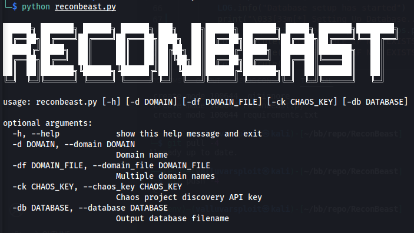

# ReconBeast
ReconBeast is a python wrapper around subdomain enumeration tools.

## Features
Subdomain Enumeration
Subdomain Probing
Store results in a Database
Logs

## Setup
```bash
git clone https://github.com/the-valluvarsploit/ReconBeast.git
cd reconbeast/
pip install -r requirements.txt
```

## Usage
```bash
python reconbeast.py -d example.com
```

ReconBeast</img>
